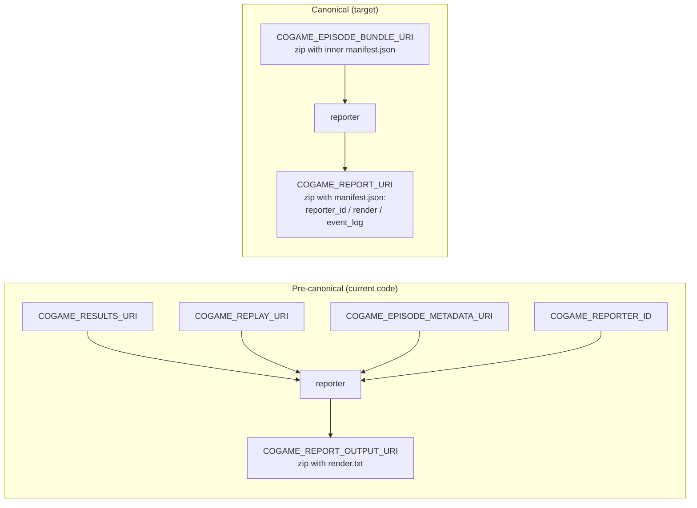
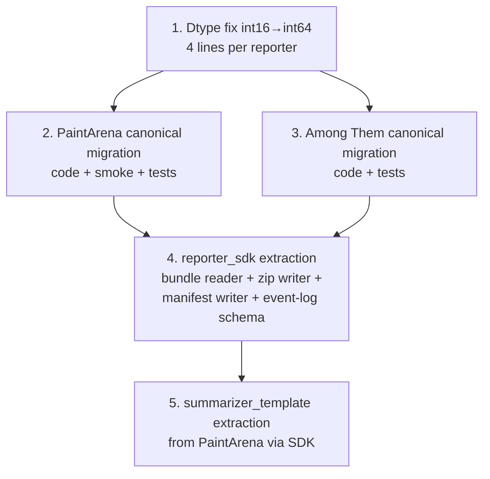

# Code-vs-docs gap in `Metta-AI/reporters` — what needs to change to make the code match the contract

> Topic: where the Python code in this repo lags the docs (which after the 2026-05-23 doc sweep match metta's authoritative canonical reporter contract), and exactly which edits close the gap. Audience: the next coding agent or human maintainer who picks up the canonical-contract migration. Date: 2026-05-23.

## Executive summary

- The two implemented reporters (`paint_arena_summarizer.py`, `among_them_summarizer.py`) ship a **pre-canonical** reporter contract: five separate input env vars, an output env var named `COGAME_REPORT_OUTPUT_URI`, and a top-level `render.txt` file inside the output zip. Both READMEs and DESIGN.mds describe the **canonical** contract from metta: one `COGAME_EPISODE_BUNDLE_URI` input (a bundle zip with an inner `manifest.json`), one `COGAME_REPORT_URI` output, and an in-zip `manifest.json` flagging `reporter_id` / `render` / `event_log`. Both reporters also declare the event-log Parquet's `player` column as `pa.int16()` while the canonical schema is `int64`.
- Four discrete deltas need to land — three reshape I/O (input env-var set, output env-var name, in-zip render manifest), one reshapes the Parquet schema (`player` dtype). The artifact files themselves (`summary.html`, `stats.json`, `events.parquet`, `proximity.parquet`) carry over essentially unchanged: only how they're *flagged* and *fetched* changes. Edits touch ~12 sites across two reporters, two test files, and one smoke harness; estimated effort is a single focused PR per reporter.

## Table of contents

1. Background — what "canonical" means here
2. The four gaps
3. Per-file change list
4. Test, smoke, and CI impact
5. Sequencing and risk
6. Appendix A — contract-vs-code matrix
7. Appendix B — bundle reader sketch
8. Sources

---

## 1. Background — what "canonical" means here

- **Canonical = the contract in metta** at `~/coding/metta/packages/coworld/src/coworld/docs/roles/reporter.md`. That doc is authoritative; this repo's docs (`README.md`, `docs/REPORTER_DESIGN.md`, the per-reporter READMEs/DESIGN.mds) restate it. After the 2026-05-23 doc sweep they all agree.
- **Pre-canonical = the shape the code was written against** before the bundle-layer contract landed in metta. It exposed each artifact through its own env-var URI (`COGAME_RESULTS_URI`, `COGAME_REPLAY_URI`, `COGAME_EPISODE_METADATA_URI`), used `COGAME_REPORT_OUTPUT_URI` for output, and flagged the renderable target via a `render.txt` file at the zip root.

The migration changes how outputs are *flagged*, not what they *are*. Per the migration table in `docs/REPORTER_DESIGN.md:118-133`:

| Concern | Pre-canonical (current code) | Canonical (metta) |
| --- | --- | --- |
| Input | `COGAME_RESULTS_URI`, `COGAME_REPLAY_URI`, `COGAME_EPISODE_METADATA_URI`, `COGAME_LOG_URI`, `COGAME_REPORTER_ID` | `COGAME_EPISODE_BUNDLE_URI` (bundle zip with inner `manifest.json`) |
| Output env var | `COGAME_REPORT_OUTPUT_URI` | `COGAME_REPORT_URI` |
| In-zip render manifest | `render.txt` (text, one path per line) | `manifest.json` (`reporter_id`, `render`, `event_log`) |
| Trigger | Per-episode, auto-fired from runner | On-demand, fired by CLI / button / pipeline |

The trigger row is platform-side, not in-code — the reporters themselves do not change behavior based on the trigger.



---

## 2. The four gaps

### 2.1 Input: five env vars → one bundle URI + a bundle reader

- **What docs say.** A reporter reads exactly one env var: `COGAME_EPISODE_BUNDLE_URI`, a `.zip` containing the episode's artifacts plus an inner `manifest.json` with `ereq_id` / `status` / `include` / `files`. Consumers read from `files` rather than hard-coding paths. Cited at metta `docs/roles/reporter.md:25-33` and `EPISODE_BUNDLE_README.md:29-58`.
- **What code does.** Reads five distinct env vars and fetches each artifact independently. Cited at `paint_arena_summarizer.py:51-58` and `among_them_summarizer.py:65-72`.
- **Why this matters.** It is the load-bearing migration. The bundle reader replaces the per-URI fetch pattern with one zip open + inner-manifest dispatch.

### 2.2 Output env var name

- **What docs say.** `COGAME_REPORT_URI`. Cited at metta `docs/roles/reporter.md:39-41`.
- **What code does.** `COGAME_REPORT_OUTPUT_URI`. Cited at `paint_arena_summarizer.py:56` and `among_them_summarizer.py:70`.
- **Why this matters.** Single-string rename in the env-var reader plus the smoke harness. Test fixtures need the same rename.

### 2.3 In-zip render manifest: `render.txt` → `manifest.json`

- **What docs say.** The reporter writes a top-level `manifest.json` inside the output zip, with `reporter_id` (recommended), `render` (optional path to a single `.md` or `.html`), and `event_log` (optional path to a single Parquet with `(ts, player, key, value)` columns). Cited at metta `docs/roles/reporter.md:43-58`.
- **What code does.** Writes a `render.txt` whose single line is the renderable path. No `reporter_id` is emitted into the zip; the reporter id only lands as a log string. Cited at `paint_arena_summarizer.py:921-948` and `among_them_summarizer.py:1611-1641`.
- **Why this matters.** Downstream consumers (Observatory render path, diagnoser/optimizer "open the reporter's event log") look up `event_log` and `render` from `manifest.json`. Current zips simply do not expose `event_log` as a privileged path — the Parquet file is in the zip, but no manifest field flags it.

### 2.4 Event-log Parquet `player` column dtype

- **What docs say.** `player: int64`. Cited at metta `docs/roles/reporter.md:66-71` (and now consistently in `reporters/docs/REPORTER_DESIGN.md:92-99`, both per-reporter READMEs, and both DESIGN.mds after the 2026-05-23 doc sweep).
- **What code does.** `pa.int16()` in both reporters' `EVENT_LOG_SCHEMA` and the corresponding `pa.array(..., type=pa.int16())` call. Cited at `paint_arena_summarizer.py:430,506` and `among_them_summarizer.py:161,180`.
- **Why this matters.** Cross-reporter aggregation in Pandas/DuckDB needs a stable column dtype; `int16` and `int64` Parquet columns will not concat cleanly, and the canonical contract picked `int64` so callers do not have to widen on read.

---

## 3. Per-file change list

The changes are listed in dependency order: dtype fix is independent and trivially landable; the contract migration is one cohesive patch per reporter.

### 3.1 `reporters/paint_arena/paint_arena_summarizer/paint_arena_summarizer.py`

- **L430, L506** — change `pa.int16()` → `pa.int64()` (the schema field and the array constructor must agree).
- **L43-58 (`ReporterInputs`, `load_reporter_inputs`)** — replace the five-field dataclass with a single-field one:
  ```python
  class ReporterInputs(BaseModel):
      episode_bundle_uri: str
      report_uri: str
      reporter_id: str = "paint-arena-summarizer"  # hard-coded, no longer env-supplied

  def load_reporter_inputs() -> ReporterInputs:
      return ReporterInputs(
          episode_bundle_uri=os.environ["COGAME_EPISODE_BUNDLE_URI"],
          report_uri=os.environ["COGAME_REPORT_URI"],
      )
  ```
  The reporter id is conventionally fixed per image (see metta `docs/roles/reporter.md:55` — `reporter_id` "conventionally matches the runnable's `id` in `manifest.reporter[]`"), so a module-level constant is cleaner than an env var.
- **Add a bundle reader inline** (Appendix B is a sketch). Opens the bundle zip via `read_uri`, parses the inner `manifest.json`, exposes `read_json("results")`, `read_json("replay")`, `read_json_optional("config")`, and `inner_manifest()` for `ereq_id`.
- **L916-950 (`build_zip_bytes`)** — drop the `render_txt = b"summary.html\n"` line and the `("render.txt", render_txt)` zip entry; replace with a `("manifest.json", manifest_json_bytes)` entry whose contents are:
  ```json
  {"reporter_id": "paint-arena-summarizer", "render": "summary.html", "event_log": "proximity.parquet"}
  ```
  serialized with `_stable_json` (compact, sorted) for byte-identical reruns.
- **L956-962 (`run`)** — replace the three `read_json` calls with bundle-reader calls. `episode_id` and `variant_id` that today come from `episode_metadata_uri` come from `bundle.inner_manifest()` plus the embedded `replay.json` / `results.json` per `paint_arena_summarizer/DESIGN.md:32`.

### 3.2 `reporters/paint_arena/paint_arena_summarizer/smoke.sh`

- **L36-40** — replace the five `-e COGAME_*_URI=...` lines with two:
  ```bash
  -e COGAME_EPISODE_BUNDLE_URI=file:///in/bundle.zip
  -e COGAME_REPORT_URI=file:///out/report.zip
  ```
- **L7-10 comment block** — replace `"render.txt lists summary.html"` with `"manifest.json flags summary.html as render and proximity.parquet as event_log"`.
- **L64, L66, L80-93** — drop the `RENDERABLE_EXTS` list including `.txt`; replace the `render.txt`-shaped assertions with `manifest.json`-shaped ones: parse JSON, assert `render` is `"summary.html"`, assert `event_log` is `"proximity.parquet"`, assert both target paths exist in the zip, assert `render` ends in `.html`, assert `event_log` opens as a Parquet table. Drop the `.htm` / `.txt` allowance.
- **`smoke/fixtures/`** — pack `results.json` + `replay.json` + an inner `manifest.json` into a `bundle.zip` (the fixture inputs become a bundle, not three loose files). Either commit the bundle, or `zip` it as a smoke prologue.

### 3.3 `reporters/paint_arena/paint_arena_summarizer/tests/test_paint_arena_summarizer.py`

- **L7-14 docstring** — repoint the contract-summary at `manifest.json` and `COGAME_REPORT_URI`.
- **L36-38** — drop `_RENDERABLE_EXTS` containing `.txt`; replace `_EXPECTED_ENTRIES` `render.txt` → `manifest.json`.
- **L69-72 `_render_lines`** — delete; replace with a `_manifest_dict(payload)` helper that JSON-decodes the `manifest.json` entry.
- **End-to-end tests that set env vars** — switch to setting `COGAME_EPISODE_BUNDLE_URI` against a fixture bundle zip, plus `COGAME_REPORT_URI`. Provide a `make_bundle_zip(...)` helper alongside the existing `make_results_happy()` / `make_replay()` / `make_metadata()` fixtures.
- **Assertions that crack open `render.txt`** — switch to JSON-parsing the in-zip `manifest.json` and asserting `render` and `event_log` shape.

### 3.4 `reporters/among_them/among_them_summarizer/among_them_summarizer.py`

- **L161, L180** — `pa.int16()` → `pa.int64()` (same dtype fix as PaintArena).
- **L21-26 docstring zip layout** — replace the `render.txt` line with `manifest.json` (the docstring still describes the pre-canonical layout even though the README/DESIGN don't).
- **L57-72 (`ReporterInputs`, `load_reporter_inputs`)** — same single-bundle-URI rewrite as PaintArena.
- **Add the bundle reader inline** (or share with PaintArena if the SDK extraction is being done in the same pass; see §5).
- **L1611-1641 (`build_zip_bytes`)** — drop the `render_txt = b"summary.html\n"` and the `("render.txt", render_txt)` entry; add a `("manifest.json", ...)` entry with `reporter_id="among-them-summarizer"`, `render="summary.html"`, `event_log="events.parquet"`.
- **L1648-1660 (`run`)** — replace the three reads with bundle-reader calls. Note that Among Them's "replay" is a binary `.bitreplay` payload, currently fetched as raw bytes via `read_uri`; under the canonical contract it is the `replay` entry in the bundle, accessed via `bundle.read_bytes("replay")` (the bundle still calls the entry `replay.json` per the bundle contract; the bytes inside are the `.bitreplay` blob).

### 3.5 `reporters/among_them/among_them_summarizer/tests/test_skeleton.py`

- **L25-30** — drop the five `monkeypatch.setenv("COGAME_*_URI", ...)` lines; replace with two (`COGAME_EPISODE_BUNDLE_URI`, `COGAME_REPORT_URI`) against a fixture bundle zip.
- Anywhere the test reads the resulting zip and expects a `manifest.json` entry with `reporter_id` — assert the canonical fields rather than a placeholder.

### 3.6 `reporters/among_them/among_them_summarizer/tests/test_phase2.py`

- **L36** — `_EXPECTED_ENTRIES` `render.txt` → `manifest.json`.
- **L34** — drop `_RENDERABLE_EXTS` containing `.txt`; restrict to `.md`, `.html` only (the post-2026-05-23 doc sweep removed `.htm` from the design too).
- **L198-220** — replace `test_render_txt_lists_summary_html_only` and `test_render_txt_entries_have_renderable_extensions` with their JSON equivalents: `test_manifest_flags_summary_html_as_render`, `test_manifest_flags_events_parquet_as_event_log`, `test_manifest_render_has_renderable_extension`.

### 3.7 `reporters/among_them/among_them_summarizer/{Dockerfile,build.sh}` and `reporters/paint_arena/paint_arena_summarizer/{Dockerfile,build.sh}`

- No changes required. The Dockerfiles are env-agnostic; the only references to URIs live in `smoke.sh` (which is already in scope). Verified by reading `paint_arena_summarizer/Dockerfile`.

---

## 4. Test, smoke, and CI impact

- **Pytest suite size.** PaintArena has one test module; Among Them has five (`test_skeleton.py`, `test_phase2.py`, `test_phase3.py`, `test_phase4.py`, `test_phase5.py`). Only `test_skeleton.py` and `test_phase2.py` reference the pre-canonical contract directly. `test_phase3.py`–`test_phase5.py` exercise the replay parser, input analytics, and HTML rendering — all internal to the reporter and unaffected by the I/O contract.
- **New fixture needed.** A `make_bundle_zip(results, replay, metadata)` helper that packs a synthetic bundle. Conceptually it is `write_deterministic_zip([("manifest.json", inner), ("results.json", results), ("replay.json", replay)])`. Putting it in the existing `tests/fixtures.py` modules keeps it local; promoting it to `reporter_sdk` is reasonable once the SDK extraction starts.
- **Determinism check** (PaintArena `test_run_is_byte_identical_on_rerun`). After the migration, the zip carries a JSON `manifest.json` instead of a 1-line text file; the determinism check still holds as long as `manifest.json` is serialized with sorted keys + compact separators (`_stable_json`).
- **No new external dependencies.** `json`, `zipfile`, `pydantic`, `pyarrow` already cover everything.

---

## 5. Sequencing and risk



- **Land the dtype fix first** as its own commit. It is two tiny one-line changes per reporter, and it makes the docs and code agree on the schema without touching the I/O contract. Low risk; high signal that the doc sweep is being honored in code.
- **Migrate one reporter at a time.** PaintArena is simpler (no binary replay format complications) and serves as the integration check for the bundle-reader pattern. Once PaintArena is green end-to-end against a real bundle fixture, repeat the same pattern in Among Them.
- **Do not interleave with `reporter_sdk` extraction.** Per `reporters/reporter_sdk/README.md:7`, the SDK extraction is *gated* on the canonical migration. Extract after both reporters land on the canonical shape, so the SDK's API reflects the canonical contract rather than the pre-canonical one.
- **Upstream coordination.** Metta's reference reporters under `~/coding/metta/packages/coworld/src/coworld/examples/paintarena/reporter/` (`paint_arena_summarizer.py`, `stats_reporter.py`) are in the same pre-canonical state per metta `docs/roles/reporter.md:104-106`. The repo-level docs in both places call out that these "should land together"; a cross-repo PR pair is the cleanest landing.

### Risk surface

- **Bundle reader bugs.** Most of the migration risk lives in one new component. Mitigation: write the bundle reader as a standalone helper with its own unit tests (open zip → parse inner `manifest.json` → resolve token to file path) before plumbing it into either reporter.
- **Smoke fixture drift.** The `smoke/fixtures/` layout changes from three loose files to one bundle zip. Recommend a `make-bundle.py` helper checked in next to the fixtures so the zip can be regenerated deterministically rather than committed as opaque bytes.
- **Among Them's binary replay.** The bundle stores it under the `replay` token but the bytes are `.bitreplay`, not JSON. Confirmed already-handled by current code (`read_uri` returns bytes), so as long as the new bundle reader exposes `read_bytes(token)` alongside `read_json(token)`, behavior carries over.

---

## Appendix A — contract-vs-code matrix

| Concern | metta canonical | reporters doc (post 2026-05-23) | paint_arena code | among_them code |
| --- | --- | --- | --- | --- |
| Input env var | `COGAME_EPISODE_BUNDLE_URI` | matches | `COGAME_RESULTS_URI` + `_REPLAY_URI` + `_EPISODE_METADATA_URI` (L53-55) | same (L67-69) |
| Output env var | `COGAME_REPORT_URI` | matches | `COGAME_REPORT_OUTPUT_URI` (L56) | same (L70) |
| Reporter id | inside `manifest.json` `reporter_id` field | matches | `COGAME_REPORTER_ID` env var (L57) | same (L71) |
| In-zip render manifest | `manifest.json` (`reporter_id`, `render`, `event_log`) | matches | `render.txt` single line (L941, 948) | `render.txt` single line (L1634, 1640) |
| `render` allowed extensions | `.md` or `.html` | matches | (smoke L64) also allows `.txt`, `.htm` | (test L34) also allows `.txt`, `.htm` |
| Event-log Parquet `ts` dtype | `int64` | matches | `pa.int64()` (L429) ✓ | `pa.int64()` (L160) ✓ |
| Event-log Parquet `player` dtype | `int64` | matches | `pa.int16()` (L430, 506) ✗ | `pa.int16()` (L161, 180) ✗ |
| Event-log Parquet `key` dtype | string | matches | `pa.string()` ✓ | `pa.string()` ✓ |
| Event-log Parquet `value` dtype | string | matches | `pa.string()` ✓ | `pa.string()` ✓ |

✓ = code matches contract; ✗ = code lags contract.

---

## Appendix B — bundle reader sketch

A minimum bundle reader that satisfies the canonical contract. Belongs inline in each reporter for the first migration, then lifted to `reporter_sdk` in the extraction pass:

```python
from dataclasses import dataclass
from typing import Any

@dataclass(frozen=True)
class BundleInnerManifest:
    ereq_id: str
    status: str               # "success" | "failed"
    include: list[str]        # tokens actually delivered after access-control filtering
    files: dict[str, Any]     # token -> path-in-zip (str for single-file tokens, dict for multi-file)

class BundleReader:
    def __init__(self, bundle_uri: str) -> None:
        self._bytes = read_uri(bundle_uri)          # existing helper; file:// + http(s)://
        self._zf = zipfile.ZipFile(io.BytesIO(self._bytes))
        self._manifest = self._read_inner_manifest()

    def _read_inner_manifest(self) -> BundleInnerManifest:
        raw = json.loads(self._zf.read("manifest.json"))
        return BundleInnerManifest(
            ereq_id=raw["ereq_id"],
            status=raw["status"],
            include=raw["include"],
            files=raw["files"],
        )

    def inner_manifest(self) -> BundleInnerManifest:
        return self._manifest

    def read_bytes(self, token: str) -> bytes:
        path = self._manifest.files[token]
        if not isinstance(path, str):
            raise TypeError(f"token {token!r} maps to multi-file entry; use read_bytes_at")
        return self._zf.read(path)

    def read_bytes_optional(self, token: str) -> bytes | None:
        if token not in self._manifest.include:
            return None
        return self.read_bytes(token)

    def read_json(self, token: str) -> Any:
        return json.loads(self.read_bytes(token))

    def read_json_optional(self, token: str) -> Any | None:
        raw = self.read_bytes_optional(token)
        return None if raw is None else json.loads(raw)

    def __enter__(self) -> "BundleReader":
        return self

    def __exit__(self, *exc: object) -> None:
        self._zf.close()
```

Behaves correctly against the bundle manifest schema cited at metta `EPISODE_BUNDLE_README.md:29-58`. Handles the access-control filter rule cited at metta `EPISODE_BUNDLE_README.md:97-112` by surfacing `None` for tokens not in `manifest.include`.

---

## Sources

- `~/coding/metta/packages/coworld/src/coworld/docs/roles/reporter.md` — canonical reporter role contract (input, output, render manifest, event-log schema, execution model).
- `~/coding/metta/packages/coworld/src/coworld/EPISODE_BUNDLE_README.md` — bundle contract (inner `manifest.json` shape, include tokens, access control).
- `reporters/docs/REPORTER_DESIGN.md:118-133` — migration-state table; the load-bearing local restatement of what to migrate.
- `reporters/docs/COWORLD_REFERENCE.md:380` — gotcha #7: `manifest.json` is canonical, `render.txt` is not.
- `reporters/paint_arena/paint_arena_summarizer/paint_arena_summarizer.py:43-58, 427-432, 505-510, 916-950, 956-962`.
- `reporters/paint_arena/paint_arena_summarizer/smoke.sh:36-93`.
- `reporters/paint_arena/paint_arena_summarizer/tests/test_paint_arena_summarizer.py:7-14, 36-38, 69-72`.
- `reporters/among_them/among_them_summarizer/among_them_summarizer.py:21-26, 57-72, 155-184, 1608-1660`.
- `reporters/among_them/among_them_summarizer/tests/test_skeleton.py:25-30`.
- `reporters/among_them/among_them_summarizer/tests/test_phase2.py:15, 34-36, 198-220`.
- `reporters/reporter_sdk/README.md:5-7` — confirms the SDK extraction is gated on this migration.
